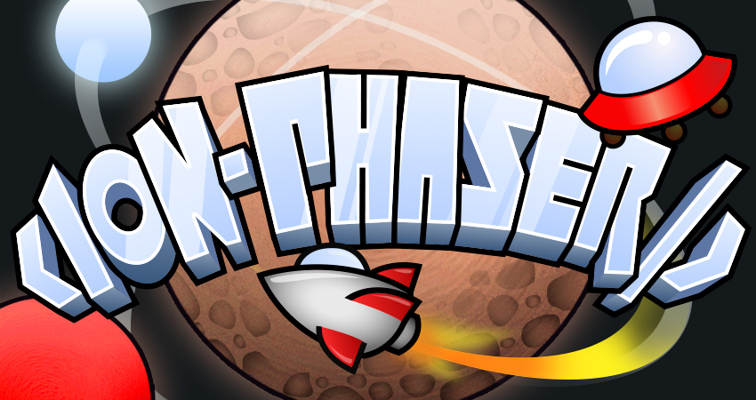

![Built With Stencil](https://img.shields.io/badge/-Built%20With%20Stencil-16161d.svg?logo=data%3Aimage%2Fsvg%2Bxml%3Bbase64%2CPD94bWwgdmVyc2lvbj0iMS4wIiBlbmNvZGluZz0idXRmLTgiPz4KPCEtLSBHZW5lcmF0b3I6IEFkb2JlIElsbHVzdHJhdG9yIDE5LjIuMSwgU1ZHIEV4cG9ydCBQbHVnLUluIC4gU1ZHIFZlcnNpb246IDYuMDAgQnVpbGQgMCkgIC0tPgo8c3ZnIHZlcnNpb249IjEuMSIgaWQ9IkxheWVyXzEiIHhtbG5zPSJodHRwOi8vd3d3LnczLm9yZy8yMDAwL3N2ZyIgeG1sbnM6eGxpbms9Imh0dHA6Ly93d3cudzMub3JnLzE5OTkveGxpbmsiIHg9IjBweCIgeT0iMHB4IgoJIHZpZXdCb3g9IjAgMCA1MTIgNTEyIiBzdHlsZT0iZW5hYmxlLWJhY2tncm91bmQ6bmV3IDAgMCA1MTIgNTEyOyIgeG1sOnNwYWNlPSJwcmVzZXJ2ZSI%2BCjxzdHlsZSB0eXBlPSJ0ZXh0L2NzcyI%2BCgkuc3Qwe2ZpbGw6I0ZGRkZGRjt9Cjwvc3R5bGU%2BCjxwYXRoIGNsYXNzPSJzdDAiIGQ9Ik00MjQuNywzNzMuOWMwLDM3LjYtNTUuMSw2OC42LTkyLjcsNjguNkgxODAuNGMtMzcuOSwwLTkyLjctMzAuNy05Mi43LTY4LjZ2LTMuNmgzMzYuOVYzNzMuOXoiLz4KPHBhdGggY2xhc3M9InN0MCIgZD0iTTQyNC43LDI5Mi4xSDE4MC40Yy0zNy42LDAtOTIuNy0zMS05Mi43LTY4LjZ2LTMuNkgzMzJjMzcuNiwwLDkyLjcsMzEsOTIuNyw2OC42VjI5Mi4xeiIvPgo8cGF0aCBjbGFzcz0ic3QwIiBkPSJNNDI0LjcsMTQxLjdIODcuN3YtMy42YzAtMzcuNiw1NC44LTY4LjYsOTIuNy02OC42SDMzMmMzNy45LDAsOTIuNywzMC43LDkyLjcsNjguNlYxNDEuN3oiLz4KPC9zdmc%2BCg%3D%3D&colorA=16161d&style=flat-square)
[](https://github.com/proyecto26/ion-phaser/graphs/commit-activity)
[![NPM version][npm-image]][npm-url]
[![Downloads][downloads-image]][npm-url]
[![TotalDownloads][total-downloads-image]][npm-url]
[![Twitter Follow][twitter-image]][twitter-url]

[npm-image]:http://img.shields.io/npm/v/@ion-phaser/core.svg
[npm-url]:https://npmjs.org/package/@ion-phaser/core
[downloads-image]:http://img.shields.io/npm/dm/@ion-phaser/core.svg
[total-downloads-image]:http://img.shields.io/npm/dt/@ion-phaser/core.svg?label=total%20downloads
[twitter-image]:https://img.shields.io/twitter/follow/jdnichollsc.svg?style=social&label=Follow%20me
[twitter-url]:https://twitter.com/jdnichollsc


# IonPhaser
Web Component built with **[Stencil.js](https://github.com/ionic-team/stencil)** to integrate **[Phaser](https://github.com/photonstorm/phaser)** with any other framework.
<p align="center">
  
</p>
<p align="center">Inspired by the old <a href="https://github.com/jdnichollsc/IonPhaser">IonPhaser directive</a></p>

## Demo

Do you want to see this web component in action? Visit https://codepen.io/jdnichollsc/full/oRrwKM yay! 🎉

## IonPhaser CE
Looking for [Phaser Framework CE (Community Edition)](https://github.com/photonstorm/phaser-ce)? Check [here](https://github.com/proyecto26/ion-phaser-ce)!

## Getting Started

### Packages

| Project | Package | Version | Links |
| ------- | ------- | ------- |:-----:|
| **Core** | [`@ion-phaser/core`](https://www.npmjs.com/package/@ion-phaser/core) | [](https://www.npmjs.com/package/@ion-phaser/core) | [`README.md`](./README.md)
| **React** | [`@ion-phaser/react`](https://www.npmjs.com/package/@ion-phaser/react) | [](https://www.npmjs.com/package/@ion-phaser/react) | [`README.md`](react/README.md)

### Script tag

- Put a script tag similar to this `<script src='https://unpkg.com/@ion-phaser/core@1.2.2/dist/ionphaser.js'></script>` in the head of your index.html
- Then you can use the element anywhere in your template, JSX, html etc

### Node Modules
- Run `npm install @ion-phaser/core --save`
- Put a script tag similar to this `<script src='node_modules/@ion-phaser/core/dist/ionphaser.js'></script>` in the head of your index.html
- Then you can use the element anywhere in your template, JSX, html etc

### In a stencil-starter app
- Run `npm install @ion-phaser/core --save`
- Add an import to the npm packages `import @ion-phaser/core;`
- Then you can use the element anywhere in your template, JSX, html etc

## Usage
Simply add this tag wherever you want in your project:
```html
<ion-phaser [game]="game"></ion-phaser>
```

These properties are available on the component:
- [_game_](#configuration) (**required**)
- **initialize** (optional)

# Framework integrations

## Angular

Using `ion-phaser` component within an Angular project:

### Including the Custom Elements Schema

Including the `CUSTOM_ELEMENTS_SCHEMA` in the module allows the use of Web Components in the HTML files. Here is an example of adding it to `AppModule`:

```ts
import { BrowserModule } from '@angular/platform-browser';
import { CUSTOM_ELEMENTS_SCHEMA, NgModule } from '@angular/core';
import { AppComponent } from './app.component';

@NgModule({
  declarations: [AppComponent],
  imports: [BrowserModule],
  bootstrap: [AppComponent],
  schemas: [CUSTOM_ELEMENTS_SCHEMA]
})
export class AppModule {}
```

The `CUSTOM_ELEMENTS_SCHEMA` needs to be included in any module that uses **IonPhaser**.

### Calling defineCustomElements

**IonPhaser** component includes a function used to load itself in the application window object. That function is called `defineCustomElements()` and needs to be executed once during the bootstrapping of your application. One convenient place to add it is in the `main.ts` file as follows:

```tsx
import { enableProdMode } from '@angular/core';
import { platformBrowserDynamic } from '@angular/platform-browser-dynamic';
import { defineCustomElements as defineIonPhaser } from '@ion-phaser/core/loader';

import { AppModule } from './app/app.module';
import { environment } from './environments/environment';

if (environment.production) {
  enableProdMode();
}

platformBrowserDynamic().bootstrapModule(AppModule)
  .catch(err => console.log(err));
defineIonPhaser(window);
```

### Using IonPhaser in an Angular component

```html
<ion-phaser
  [game]="game"
  [initialize]="initialize"
></ion-phaser>
```

```ts
public game = {
  width?: integer | string;
  height?: integer | string;
  zoom?: number;
  resolution?: number;
  type?: number;
  parent: HTMLElement | string;
  canvas?: HTMLCanvasElement;
  canvasStyle?: string;
  context?: CanvasRenderingContext2D;
  scene?: object;
  seed?: string[];
  title?: string;
  url?: string;
  version?: string;
  autoFocus?: boolean;
  input?: boolean | InputConfig;
  disableContextMenu?: boolean;
  banner?: boolean | BannerConfig;
  dom?: DOMContainerConfig;
  fps?: FPSConfig;
  render?: RenderConfig;
  backgroundColor?: string | number;
  callbacks?: CallbacksConfig;
  loader?: LoaderConfig;
  images?: ImagesConfig;
  physics?: object;
  plugins?: PluginObject | PluginObjectItem[];
  scale?: ScaleConfig;,
  instance: Game // It's created internally when the game is initialized
};

public initialize: boolean;

constructor(private api : ApiService){}

initializeGame() {
  this.game = {
    width: "100%",
    height: "100%",
    type: Phaser.AUTO,
    scene: {}
  }
  this.initialize = true
}

getInstance(){
  return this.game.instance
}
```

[_from stencil documentation_](https://github.com/ionic-team/stencil-site/blob/master/src/docs/framework-integration/angular.md)

## React

### Specific Wrapper
When using a wrapper component, It's not necessary to access the reference directly to configure the game. More details [here](./react/README.md).
```tsx
import React, { Component } from 'react'
import Phaser from 'phaser'
import { IonPhaser } from '@ion-phaser/react'

class App extends Component {
  state = {
    initialize: false,
    game: {
      width: "100%",
      height: "100%",
      type: Phaser.AUTO,
      scene: {}
    }
  }
  render() {
    const { initialize, game } = this.state
    return (
      <IonPhaser game={game} initialize={initialize} />
    )
  }
}
```

### Web Component
Other option is using the web component directly: 

```tsx
import React from 'react'
import ReactDOM from 'react-dom'
import { defineCustomElements as defineIonPhaser } from '@ion-phaser/core/loader'
import Phaser from 'phaser'

const game = {
  width: "100%",
  height: "100%",
  type: Phaser.AUTO,
  scene: {}
}

ReactDOM.render(<ion-phaser ref={el => el.game = game} />, document.getElementById('root'));

defineIonPhaser(window);
```

[_from stencil documentation_](https://github.com/ionic-team/stencil-site/blob/master/src/docs/framework-integration/react.md)

## Vue

In order to use the `ion-phaser` Web Component inside of a Vue application, it should be modified to define the custom elements and to inform the Vue compiler which elements to ignore during compilation. This can all be done within the `main.js` file as follows:

```tsx
import Vue from 'vue';
import { defineCustomElements as defineIonPhaser } from '@ion-phaser/core/loader'

import App from './App.vue';

Vue.config.productionTip = false;
Vue.config.ignoredElements = [/ion-\w*/];

// Bind the IonPhaser custom element to the window object
defineIonPhaser(window);

new Vue({
  render: h => h(App)
}).$mount('#app');
```

### Using IonPhaser in a Vue component

```vue
<template>
  <ion-phaser 
    v-bind:game.prop="game"
    v-bind:initialize.prop="initialize"
  />
</template>

<script>
import Phaser from 'phaser'
export default {
  name: 'HelloWorld',
  data() {
    return {
      initialize: false,
      game: {
        width: "100%",
        height: "100%",
        type: Phaser.AUTO,
        scene: {
          init: function() {
            this.cameras.main.setBackgroundColor('#24252A')
          },
          create: function() {
            this.helloWorld = this.add.text(
              this.cameras.main.centerX, 
              this.cameras.main.centerY, 
              "Hello World", { 
                font: "40px Arial", 
                fill: "#ffffff" 
              }
            );
            this.helloWorld.setOrigin(0.5);
          },
          update: function() {
            this.helloWorld.angle += 1;
          }
        }
      }
    }
  }
}
</script>
```

[_from stencil documentation_](https://github.com/ionic-team/stencil-site/blob/master/src/docs/framework-integration/vue.md)

## Supporting 🍻
I believe in Unicorns 🦄
Support [me](http://www.paypal.me/jdnichollsc/2), if you do too.

## Enterprise 💼

Available as part of the Tidelift Subscription.

The maintainers of IonPhaser and thousands of other packages are working with Tidelift to deliver commercial support and maintenance for the open source dependencies you use to build your applications. Save time, reduce risk, and improve code health, while paying the maintainers of the exact dependencies you use. [Learn more.](https://tidelift.com/subscription/pkg/npm-ion-phaser-core?utm_source=npm-ion-phaser-core&utm_medium=referral&utm_campaign=enterprise&utm_term=repo)

## Security contact information 🚨
To report a security vulnerability, please use the [Tidelift security contact](https://tidelift.com/security). Tidelift will coordinate the fix and disclosure.

## Happy coding 💯
Made with ❤️


